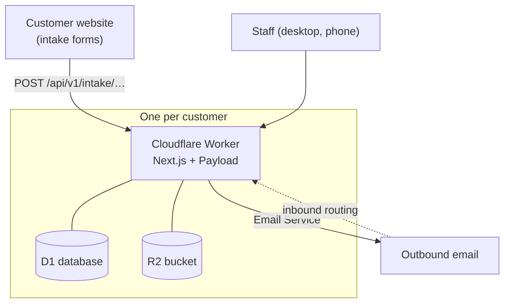
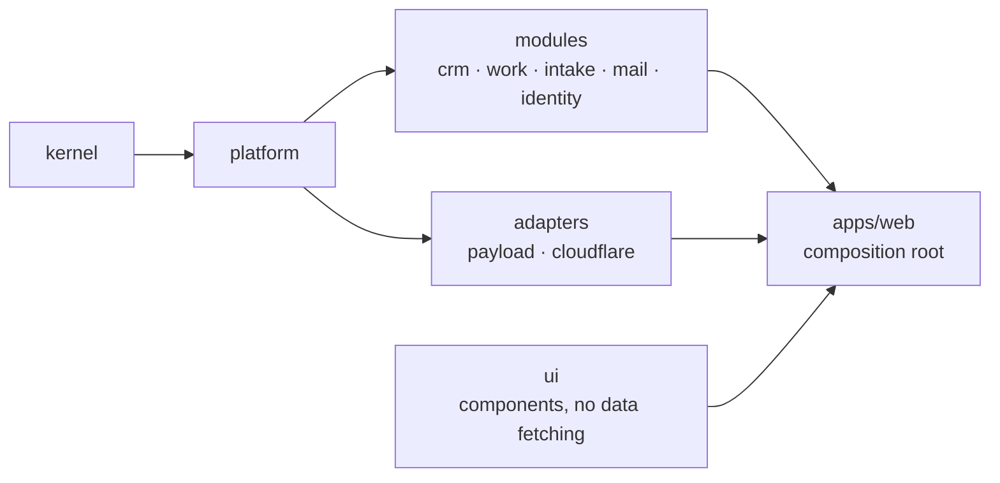

<div align="center">

# ops-platform

**A white-label CRM and project operations platform for service businesses.**
One codebase. One isolated Worker, database and file store per customer.

[](https://github.com/AbdullahSaeed1211/kiiro-crm/actions/workflows/ci.yml)


</div>

---

## Overview

ops-platform gives an agency or service team one place to win work and deliver it: leads come in, move through a pipeline, become clients, and start projects with their tasks already laid out.

It is **white-label by construction**. No tenant is the product: names, domains, colours and people live in one file per customer (`tenants/<slug>.jsonc`) and in that customer's own settings. Every tenant runs as its own Cloudflare Worker with its own D1 database and R2 bucket, so there are no shared rows and no cross-tenant queries.

The first tenant, Mirch Media, runs in production. The authoritative product specification is [`docs/spec.md`](docs/spec.md); [`docs/architecture.md`](docs/architecture.md) is the short map.

## What it does

| Area                | Capabilities                                                                                                                                                                                                                                   |
| ------------------- | ---------------------------------------------------------------------------------------------------------------------------------------------------------------------------------------------------------------------------------------------- |
| **Lead intake**     | Public intake endpoints with exact-origin CORS, Turnstile, rate limiting and server keys; form answers mapped to lead fields and custom fields; a lead-assignment rule that hands new leads to people in turn.                                 |
| **Pipeline**        | Configurable workflows per record type; lead and deal boards with drag-and-drop and rollback; stage requirements that name the missing fields; a first-response target that flags leads waiting too long.                                      |
| **Lead management** | Search, owner and source filters, saved views, bulk assign and bulk stage move, phone cards, duplicate warnings, next-action dates with an overdue marker, notes, editable details, and one-step conversion to contact, organization and deal. |
| **Deals to work**   | A won deal starts an onboarding project from a playbook, with its tasks and due dates, and links back to the lead it came from.                                                                                                                |
| **Work**            | Tasks with a table, board, calendar and timeline; projects with members and progress; subtasks; a mobile layout throughout.                                                                                                                    |
| **Custom fields**   | Tenant-defined fields on organizations, contacts, leads and deals, with visibility rules.                                                                                                                                                      |
| **Email**           | Per-record email threads, reusable templates, and inbound routing to the right record.                                                                                                                                                         |
| **Newsletter**      | Opt-in through contacts or a lead form question, named audiences, a signed one-click unsubscribe link, and a campaign history.                                                                                                                 |
| **Access**          | Owner, manager and staff roles with record-level scope, groups, invitations, and an audit trail of activity.                                                                                                                                   |

## Architecture



The code is layered, and the layers are enforced by ESLint boundaries and dependency-cruiser, not by convention:



- `kernel` imports nothing from the workspace; `platform` imports only `kernel`.
- `modules/*` hold business rules and use cases; they never import another module, an adapter, the UI, or Payload, Next, React or Cloudflare APIs.
- Only `adapters/payload` imports Payload. `ui` never fetches data. `apps/web` is the only place everything meets.

## Repository layout

```text
apps/
  web/            composition root: Next.js, Payload, OpenNext, the Worker entry
  mail-router/    platform-domain inbound email router Worker
packages/
  kernel/         Result, errors, clock, logger
  platform/       permissions, workflows, ports
  modules/        crm, work, intake, mail, identity
  adapters/       payload (collections, access, repositories), cloudflare (mail, cron, intake)
  ui/             vendored shadcn components and composites
  templates/      vertical templates as typed data
scripts/          quality checks, config generation, seed, provisioning and deploy
tenants/          one <slug>.jsonc per customer
docs/             spec, architecture, roadmap, plans, ADRs, backlogs, runbooks
```

Each package has a README with its purpose and public API.

## Getting started

**Prerequisites:** Node.js 22 and pnpm 10.34.5. With `manage-package-manager-versions=true` in `.npmrc`, any pnpm 10 switches to the pinned version.

```sh
pnpm install
cp apps/web/.dev.vars.example apps/web/.dev.vars
pnpm db:reset:local   # recreates the local D1 database from the migrations
pnpm seed:dev         # idempotent demo data
pnpm dev              # http://localhost:3000
```

`.dev.vars` holds local secrets; the example values work for development. Both database scripts refuse to run against a remote environment.

The seed creates four local users that share one development password, defined in `scripts/seed/data.ts`. **It is for local databases only; never reuse it anywhere else.** Sign in at `/login`; the Payload admin panel lives at `/admin` and is not part of customer navigation.

## Everyday commands

| Command                 | What it does                                                      |
| ----------------------- | ----------------------------------------------------------------- |
| `pnpm dev`              | Next.js dev server with locally emulated Cloudflare bindings      |
| `pnpm verify:fast`      | format check, typecheck, lint and tests for changed files         |
| `pnpm verify`           | every quality gate, tests, build and bundle size                  |
| `pnpm test`             | Vitest unit tests with coverage                                   |
| `pnpm test:integration` | Payload on a local D1 copy: scope, conflicts, duplicates          |
| `pnpm test:e2e`         | Playwright tests against a running app                            |
| `pnpm gen:wrangler`     | regenerates `apps/web/wrangler.jsonc` from `tenants/*.jsonc`      |
| `pnpm tenants:deploy`   | releases to every tenant, with migrations, smoke checks, rollback |

## Quality gates

`pnpm verify` runs, in order: format, typecheck, lint, dependency rules, unused code, duplication, brand and vocabulary checks, lint-waiver budget, docs, unit and integration tests, build and bundle size. CI runs it on every pull request and push to `main`.

- TypeScript strict, with `noUncheckedIndexedAccess` and `exactOptionalPropertyTypes`; no `any`, non-null assertions or enums.
- Cyclomatic complexity 8, at most 80 lines per function and 250 per file, at most two positional parameters.
- Lint waivers are scoped, must give a reason, and are capped by a budget that only goes down.
- No brand or customer names in `apps/` and `packages/`; duplication kept under 2%.

## Releasing

A release builds once and rolls out tenant by tenant. For each tenant the loop takes a database restore point, runs migrations, deploys, and runs smoke checks (health, sign-in, file storage, and an email delivery check); any failure rolls the tenant's code back.

```sh
pnpm verify
pnpm --filter web exec opennextjs-cloudflare build
OPS_ALLOW_LIVE=1 pnpm tenants:deploy --tag vX.Y.Z --execute
git tag -a vX.Y.Z -m "vX.Y.Z" && git push origin vX.Y.Z
```

Pushing a `v*` tag also starts the GitHub Deploy workflow, which needs each tenant's `INTERNAL_SECRET_<SLUG>` secret to be current. See [`docs/runbooks/deploy.md`](docs/runbooks/deploy.md), plus the runbooks for rollback, incidents, tenant provisioning and customer onboarding.

## Documentation

| Read                                                               | For                                                  |
| ------------------------------------------------------------------ | ---------------------------------------------------- |
| [`docs/spec.md`](docs/spec.md)                                     | authoritative product behavior                       |
| [`docs/architecture.md`](docs/architecture.md)                     | the short map and the conventions every change keeps |
| [`docs/roadmap.md`](docs/roadmap.md)                               | the order in which open work ships                   |
| [`docs/backlog/`](docs/backlog/)                                   | open code-health and UX findings                     |
| [`docs/adr/`](docs/adr/)                                           | architecture decisions                               |
| [`docs/design/self-serve-saas.md`](docs/design/self-serve-saas.md) | the proposal for self-serve signup and provisioning  |
| [`docs/runbooks/`](docs/runbooks/)                                 | deploy, rollback, incident and onboarding procedures |
| [`AGENTS.md`](AGENTS.md)                                           | where code lives, golden examples and working rules  |

## Contributing

Use Conventional Commits (`feat(crm): …`, `fix(web): …`). A commit that changes behavior lists what it was verified with under `Verified:`. Findings go in `docs/backlog/`; decisions in `docs/adr/`. Documentation describes current behavior only; link to the owning document instead of repeating it.

This is a proprietary codebase (`UNLICENSED`). Third-party code keeps its licence notice under [`third_party/`](third_party/).
