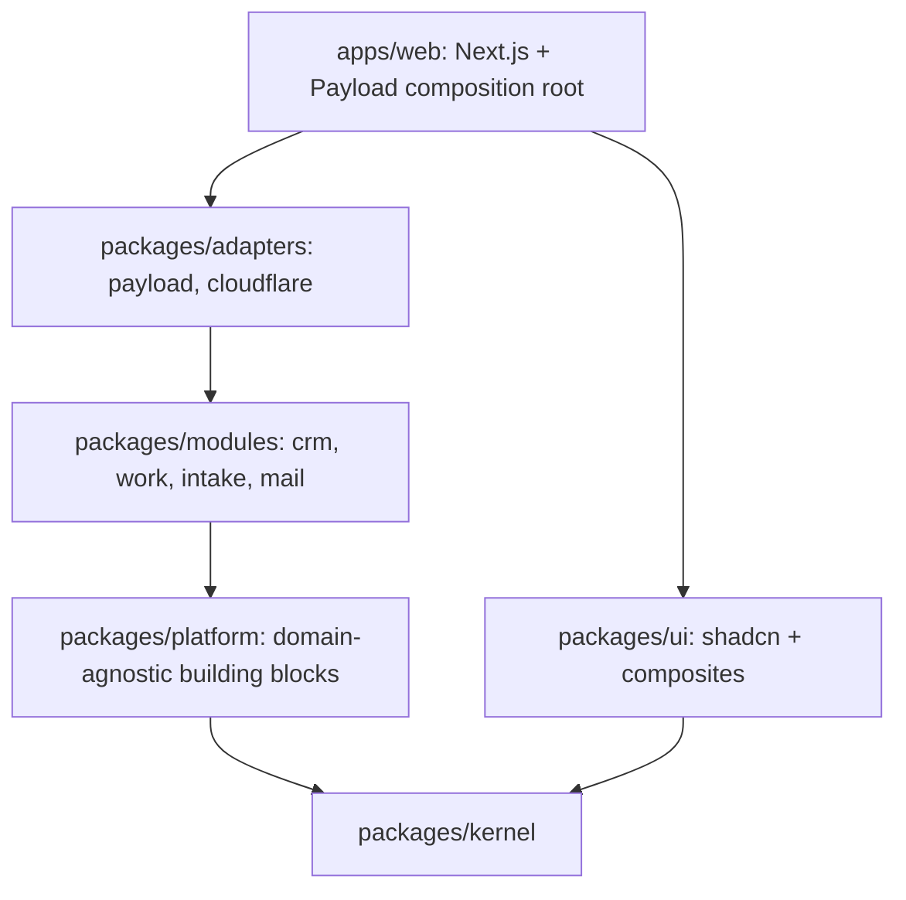
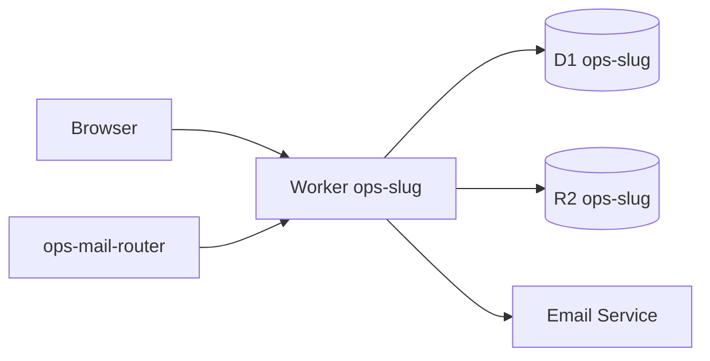

# Architecture

The authoritative specification is `docs/spec.md`. This page is the short map.

## Layers

## Per-tenant deployment

## Request lifecycle
Browser request → Worker (OpenNext) → Next.js route or Server Action → session actor → module command through ports → Payload adapter (access filter, unit of work) → D1/R2 → activity and events → response.
