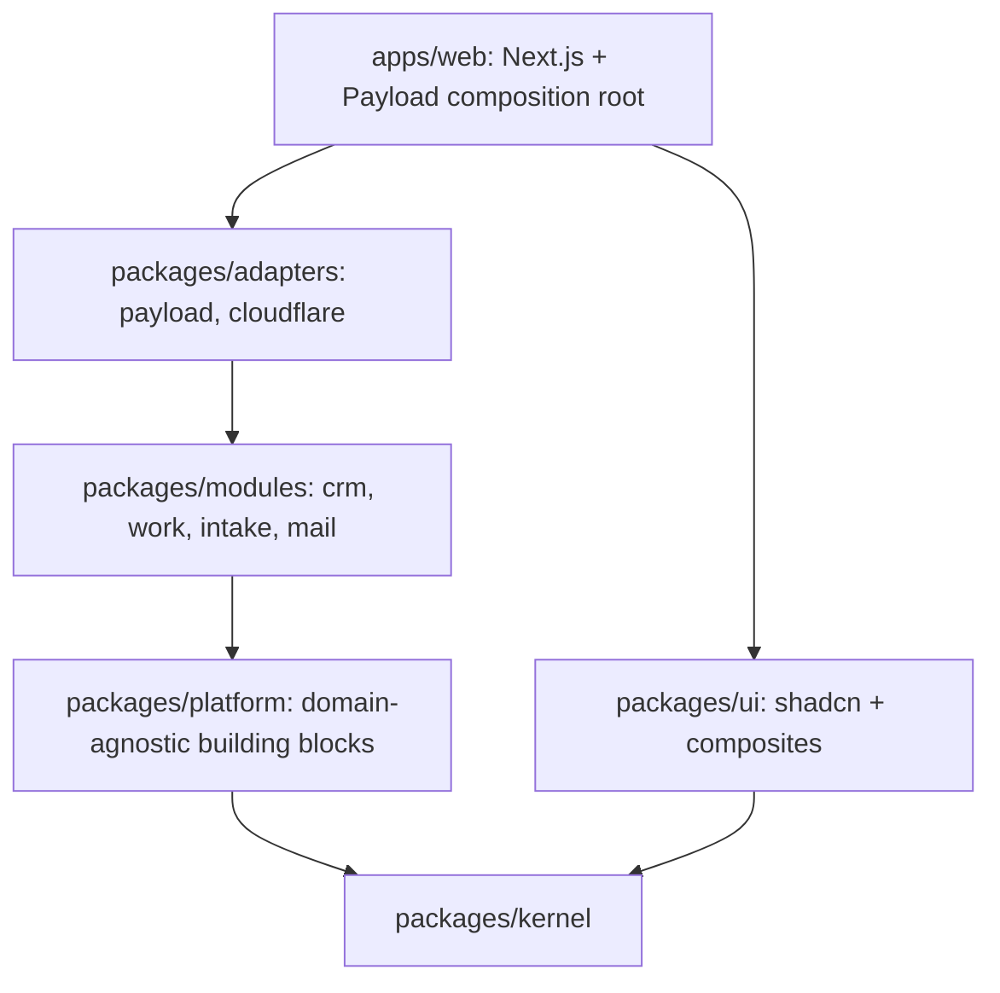
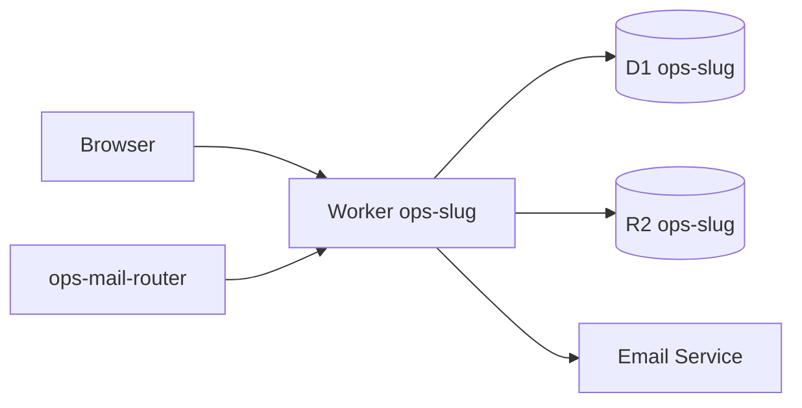
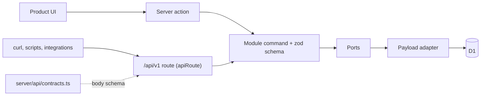

# Architecture

The authoritative specification is `docs/spec.md`. This page is the short map.

## Layers

## Per-tenant deployment

## Request lifecycle

Browser request → Worker (OpenNext) → Next.js route or Server Action → session actor → module command through ports → Payload adapter (access filter, unit of work) → D1/R2 → activity and events → response.

Two entry points reach the same module commands. Server actions serve the product UI; `/api/v1` routes serve scripts, integrations and verification (spec §12.3, ADR-0004). Both return `ActionResult` from `apps/web/src/server/action-result.ts`, and both validate with the owning module's zod schema, so a rule has one home.

## Conventions

These hold for every change; code that breaks one is listed in [the code-health backlog](backlog/code-health.md) until it is fixed.

- **One request context, loaded on the server.** `findProductContext` (API routes, `null` without a session) and `getProductContext` (pages, redirects to `/login`) in `apps/web/src/server/auth/context.ts` resolve the session, actor and Payload request once per request through React `cache`. Layouts and pages read settings the same way. The browser makes no start-up API calls; a page that needs several independent reads starts them together with `Promise.all`.
- **No credentials in browser storage.** The session is Payload's HttpOnly cookie. `localStorage` holds only per-viewer preferences (the theme choice), `sessionStorage` only transient navigation state (the task panel's focus return), and cookies only the sidebar state. Never store a token, a user record or tenant data there.
- **Tenancy is structural.** Each tenant has its own Worker, D1 database and R2 bucket (ADR-0002). Product code never reads a tenant header, never filters by a tenant id and never branches on a tenant; tenant values come from `tenants/*.jsonc` and tenant settings.
- **Settings are one Payload global.** A settings write revalidates the paths that render it; there is no separate settings cache to invalidate.
- **Validation lives in module schemas.** A command parses `unknown` input with its zod schema, and `invalidInput` turns schema issues into `error.fields`. Routes and server actions do not re-implement rules.
- **Failures are values.** Commands return `Result`; server actions and routes convert with `toActionResult`, and unexpected exceptions go through `actionFailure`, which logs the cause and returns generic copy.
- **Routes do not call Payload.** Pages and API routes call `server/` queries, server actions or module commands. `routes-no-payload` in `tooling/depcruise/.dependency-cruiser.cjs` enforces this, except for the files in `PAYLOAD_IN_ROUTES_DEBT`, which shrinks and never grows.
