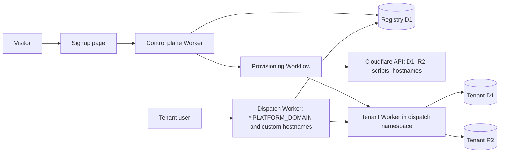

# Self-serve SaaS: sign up, then provisioning

Status: proposed · Date: 2026-09-26 · Decision record when accepted: ADR-0005

A customer signs up on a public page, and the platform provisions an isolated workspace for them without an operator, a CLI run or a code change. A control plane holds a tenant registry and runs provisioning as a durable Cloudflare Workflow that calls the Cloudflare API. Each tenant keeps its own D1 database and R2 bucket (ADR-0002), and its Worker moves into a Workers for Platforms dispatch namespace, so creating a tenant is an API upload instead of a Wrangler deploy.

## Problem

Onboarding a tenant today is an operator project, which caps growth at the operator's time.

- A tenant is a file committed to the repository, `tenants/<slug>.jsonc`, validated by `scripts/lib/tenant-schema.ts`.
- `pnpm gen:wrangler` turns the tenant files into one Wrangler environment per tenant, so a new tenant needs a commit and a redeploy of the configuration.
- `pnpm tenant:provision` runs a resumable plan of 13 steps (`provisionPlan` in `scripts/lib/provision/plan.ts`) from an operator's shell with Wrangler credentials. Its checklist step leaves three tasks to the operator: the custom domain, Email Routing and the Turnstile widget hostnames.
- Releases iterate over the tenant files in `deployOrder` (`scripts/deploy-tenants.ts`) and need `INTERNAL_SECRET_<SLUG>` for every tenant in the operator's shell.
- The operator console at `/operator` only previews a static plan (`apps/web/src/server/operator/provision.ts`).

## Goals

- A visitor can create a workspace, verify their email and reach onboarding in minutes, with no operator action.
- Isolation stays structural: one D1 database, one R2 bucket and one Worker per tenant (ADR-0002).
- Provisioning is resumable and idempotent: a failed step retries, and a rerun never creates a second database.
- Releases reach every tenant from one pipeline, with a canary, smoke checks and code rollback, as today.
- The operator can see, retry, suspend and delete tenants from a console.

## Non-goals

- Shared-database multitenancy. ADR-0002 rejects it, and nothing here needs it.
- Per-tenant code forks or tenant-specific builds. Every tenant runs the same build (spec D-48).
- Billing in the first phase. Plans and limits are modelled from the start; payment collection comes later.
- Moving the existing product modules. The product Worker is unchanged apart from reading its identity from bindings.

## Proposed design

### Control plane

A new app, `apps/control`, deployed once as its own Worker with its own D1 database. It serves the public signup page, the operator console (moved from `/operator` in the tenant app) and the control API. It is the only component that holds a Cloudflare API token, and that token is scoped to D1, R2, Workers for Platforms scripts, custom hostnames and Turnstile.

The registry replaces the tenant files as the source of truth:

| Table               | Holds                                                                                                                                                      |
| ------------------- | ---------------------------------------------------------------------------------------------------------------------------------------------------------- |
| `tenants`           | slug, display name, status (`provisioning`, `active`, `suspended`, `deleting`, `deleted`), plan, host, template, locale, time zone, currency, created time |
| `tenant_resources`  | D1 database id, R2 bucket name, script name, custom hostname id, Turnstile site key                                                                        |
| `provisioning_runs` | Workflow instance id, current step, attempts, last error code, started and finished times                                                                  |
| `owners`            | the signup email and name, verified time                                                                                                                   |
| `plans`             | seat limit, storage limit, feature flags                                                                                                                   |
| `releases`          | version, per-tenant status, restore bookmark, smoke result                                                                                                 |

`tenants/*.jsonc` stays as the import format: a script loads existing files into the registry once, and the Mirch Media tenant becomes a registry row.

### Signup

1. The visitor submits workspace name, slug, owner name and email, protected by Turnstile and a per-IP rate limit.
2. The control plane reserves the slug in `tenants` with status `provisioning`, and emails a verification link.
3. Verifying the email starts the provisioning Workflow. Unverified reservations expire after 24 hours and release the slug.
4. The visitor sees a progress page that polls the run's current step, then redirects to the new workspace's onboarding (`/onboarding` in the tenant app, which already applies a template, spec D-48).

### Provisioning Workflow

One Cloudflare Workflow instance per tenant, with the tenant id as the instance id so a second start is a no-op. Each step records its output in `tenant_resources`, and each first checks whether its resource already exists, so retries never duplicate anything.

1. **Create the D1 database** through the D1 API, named `ops-<slug>`.
2. **Create the R2 bucket** through the R2 API, named `ops-<slug>`.
3. **Generate secrets**: `PAYLOAD_SECRET`, `INTERNAL_SECRET` and `TENANT_SECRET`, as `createSecretPayload` in `scripts/lib/provision/plan.ts` does today. They are attached to the script as secret bindings and never stored in the registry.
4. **Upload the tenant Worker** to the dispatch namespace, from the current release's OpenNext artifact, with bindings for D1, R2, rate limits, the email sender and plain-text identity values (slug, host). First uploads are ready when the API returns.
5. **Apply migrations** by calling an internal migrate endpoint on the new Worker through the dispatch namespace binding. The endpoint runs Payload migrations in the Worker, replacing today's CLI `payload migrate` with remote bindings.
6. **Seed** settings, the chosen template and the owner invitation through the existing `/api/v1/internal/provision` endpoint.
7. **Route**: platform hosts (`<slug>.<PLATFORM_DOMAIN>`) need nothing more, because the dispatch Worker owns the wildcard. A custom domain creates a Cloudflare for SaaS custom hostname and waits, with `step.waitForEvent`, until its `status` and `ssl.status` are `active`.
8. **Smoke**: health, login and R2 probes against the new Worker, reusing `scripts/smoke-tenant.ts` checks.
9. **Activate**: mark the tenant `active` and email the owner their workspace link.

The control plane calls tenant Workers through the dispatch namespace binding, not over the public internet, so internal endpoints no longer depend on a shared secret in an operator's shell.

### Routing

A dispatch Worker on `*.<PLATFORM_DOMAIN>/*`, also the fallback origin for custom hostnames, maps the request host to a script name through the registry (cached in KV or in memory with a short TTL) and dispatches to it. A suspended tenant gets a status page; an unknown host gets a 404. This dispatcher replaces the planned `ops-edge-router` of spec D-49, and also the shared `ops-mail-router` for inbound mail on the platform domain.

### Releases

A release Workflow uploads the new artifact to every script in the namespace: canary tenants first, then the rest in batches. For each tenant it records a D1 restore bookmark, uploads, migrates, smokes, and on failure re-uploads the previous version and stops. This replaces `pnpm tenants:deploy` and the per-tenant secrets in the operator's shell.

### Lifecycle

- **Suspend**: the dispatcher serves a suspended page; data is untouched.
- **Delete**: export D1 and R2 to an archive bucket, then delete the script, bucket, database and hostname, and keep the registry row as `deleted` for audit.
- **Plans and limits**: seat and storage limits are read by the tenant Worker from a plain-text binding set at upload, and enforced in the member invite use case and the file upload route.

## Alternatives considered

- **Keep one ordinary Worker per tenant and create them through the Workers API.** It needs no new product, but an account holds 500 Workers on the Paid plan, every tenant shares the account's script limit with platform Workers, and routes must be managed per tenant.
- **One Worker that picks a D1 database by hostname.** Bindings are fixed when a Worker is deployed, so reaching a new tenant's database needs a redeploy or the D1 HTTP API from inside the Worker, and one bug then reaches every tenant.
- **A shared database with a tenant id column.** Rejected by ADR-0002: one missing filter leaks data between tenants, and restores and migrations have a single blast radius.
- **Keep the CLI and let an operator run it on request.** It keeps today's cost per tenant and does not meet the goal.

## Consequences

- ADR-0002's threshold of "roughly 200 tenants" for Workers for Platforms no longer applies: the reason to adopt it is API-driven creation, not tenant count. ADR-0005 records this when the design is accepted.
- Wrangler environments per tenant, `gen:wrangler`'s tenant fan-out and the per-tenant `INTERNAL_SECRET` in operator shells go away.
- The platform needs a Cloudflare account with Workers for Platforms, and the control plane token becomes the most sensitive credential in the system.
- Tenant data isolation is unchanged; the new shared components (control plane, dispatcher, registry) hold tenant metadata but no tenant records.

## Open questions

| Question                                                                                   | Owner                                                  | Why it matters                                                                  |
| ------------------------------------------------------------------------------------------ | ------------------------------------------------------ | ------------------------------------------------------------------------------- |
| Current D1 limits on databases per account and total storage per account                   | Operator, from the D1 limits page and the account team | Sets how many tenants one account can hold before a limit increase              |
| Workers for Platforms pricing at the expected tenant count                                 | Operator                                               | Replaces per-Worker pricing in the unit cost of a tenant                        |
| Whether Payload migrations run within a Worker request's CPU and time limits               | Engineering, by spike                                  | Step 5 depends on it; the fallback is applying generated SQL through the D1 API |
| Whether the OpenNext artifact and its static assets upload cleanly to a dispatch namespace | Engineering, by spike                                  | Step 4 and releases depend on it                                                |
| Email for new tenants: platform sender only, or per-tenant sending domains                 | Product                                                | Per-tenant domains bring back a manual DNS step                                 |
| Signup abuse controls beyond Turnstile, email verification and rate limits                 | Product                                                | Free trials attract automated signups                                           |

## Delivery phases

Each phase ships on its own and is verified with gates against a real Cloudflare account (see the `verify-change` skill).

1. **Registry and API-driven provisioning, operator-started.** `apps/control` with the registry, the provisioning Workflow and the operator console; the Mirch Media tenant imported. Done when an operator creates a test tenant from the console with no CLI, and a rerun of any step creates nothing new.
2. **Dispatch namespace and releases.** Tenant Workers move into the namespace, the dispatcher takes the platform wildcard, and the release Workflow replaces `tenants:deploy`. Done when a release reaches every tenant with a canary and a forced smoke failure rolls one tenant back.
3. **Public signup.** Signup page, email verification, progress page and slug expiry. Done when a new visitor reaches onboarding in their own workspace with no operator action.
4. **Custom domains.** Custom hostnames through the API, with `waitForEvent` on validation. Done when a customer's CNAME brings their domain live with a certificate.
5. **Plans, limits and billing.** Plan limits enforced in the tenant Worker, then payment collection. Done when a tenant over its seat limit cannot invite, and an upgrade lifts the limit.
